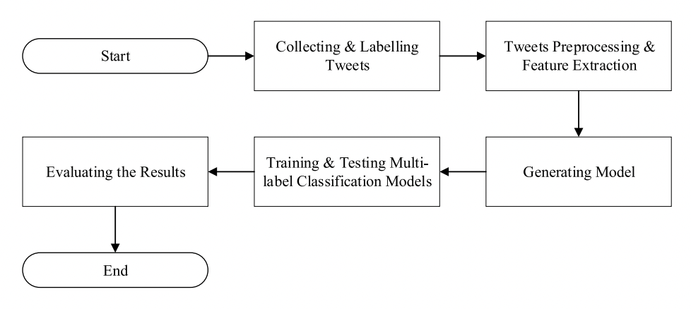

# Multilevel_Textual_Emotion_Classification

Multi-Label Textual Emotion Classification in Social Media Contents using Machine Learning Algorithms implemented with python.

# Brief Description

In this project, we have classified emotions from texts. Emotions considered in this work are Joy, Sadness, Anger, Disgust, Admiration, Surprise, Interest, Fear. We have collected our text data from twitter. We have used two algorithm adaptations methods to work with multiple labels. One is Multi-label K nearest neighbors (MLkNN) and another one combines approaches from both Binary Relevance and K-Nearest neighbor (BRkNN).

# Outline of Methodology

# Multi-Label Emotion Classifier Framework

